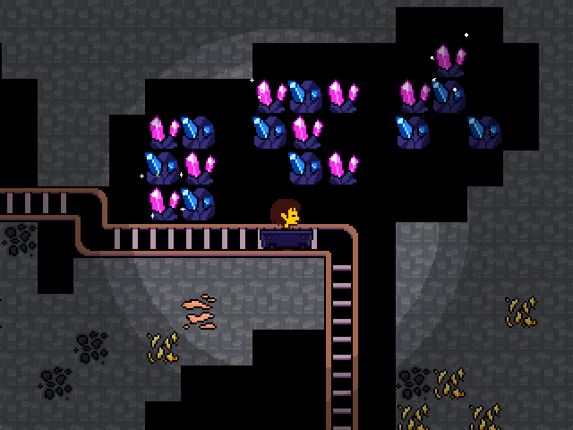
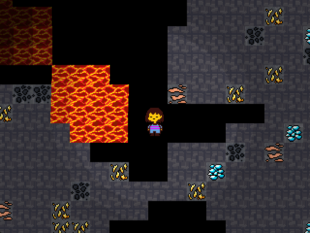

Attempt at using Undertale's RPG "engine" for a sandbox mining game.

## Installation

You need to own a copy of UNDERTALE v1.08 for this.

Download "UTMC.zip" from the latest release to follow the instructions.

1. Open DeltaPatcherLite.exe (included in the zip file)
2. For "Original File", pick the data.win file of your UNDERTALE installation (which, on Windows, should be in `C:\Program Files (x86)\Steam\steamapps\common\Undertale`).
3. For "XDelta patch", choose "UTMC.XDelta" from this download.
4. Click "Apply Patch" and let the patcher do its thing.

> [!CAUTION]
> Before running the game, backup your Undertale save files just in case (look up other guides for this)

## Features

- Infinite (?) terrain with chunk saving/loading
- Breakable tiles
- Item amounts
- Dynamite
- Explosions
- Dynamite Explosions
- Minecarts and Rails
- A super cool-looking lava effect
- Sparkly crystals

There is no goal/endgame.

## Known issues

- Minecarts & rails like to misbehave sometimes.
- The camera lags behind when the screen is shaking.
- While the mod allows you to start regular Undertale, the item amount system may render the game unplayable. I'm thinking of turning the item amount system into an own - stand-alone mod, compatible with the normal game.
- Existing minecarts aren't saved when the game closes.
